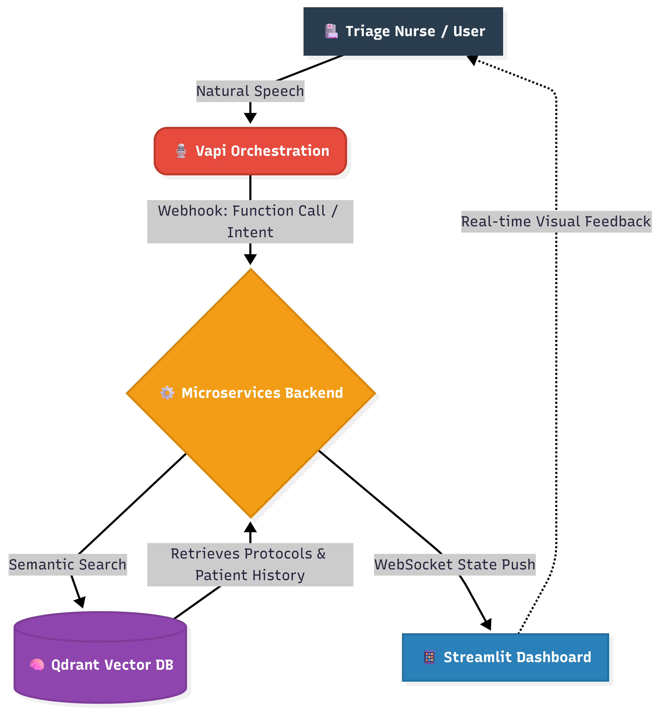

🫀 PulseAgent — Voice-Native Clinical Triage Agent | HackBLR 2026 | Vision_Architect |
 Problem Statement: PS-3 (Voice AI for Accessibility & Societal Impact)
  
Medical professionals waste 40% of their time on data entry. In emergencies, that time costs lives;
  PulseAgent eliminates it with voice
 "BP 185/110" spoken aloud — a CRITICAL urgency banner fires automatically.No button pressed, no typing, just voice.

PulseAgent eliminates it with voice.
🔴 The Problem
Medical professionals waste **40% of their time on data entry**.  
In a cardiac emergency, that time costs lives.
- 🏥 Nurses manually log vitals during triage — slowing emergency response
- ⚠️ Critical clinical protocols are buried in manuals — not accessible under pressure
- 📋 Patient history is scattered across systems — impossible to recall quickly
- 🌍 India has 1.4M registered nurses serving under-resourced rural PHCs with no digital assistance

**What if a health worker could just speak — and the system handles the rest?**

## ✅ The Solution
**PulseAgent** is a voice-first, action-oriented clinical triage agent.  
Speak patient information. Get instant clinical action. Zero keystrokes.

🚨 Why PulseAgent Wins (Action, Not Just Conversation)
Most teams build a chatbot with a voice wrapper; PulseAgent takes actions, not just answers.
This is not a prototype — it's a product with an end-to-end pipeline working live.
**🚨 What It Does**
Health worker speaks patient info → the agent triggers log_patient_info → the dashboard auto-populates.
Health worker speaks vitals → the agent triggers log_vitals → critical alerts fire automatically based on backend evaluation.
Health worker says "check protocols" → Qdrant performs a semantic search, not just keyword matching → the matched protocol is displayed.
Health worker says "recall history" → Qdrant vector memory loads past patient data from previous sessions.

🎥 Demo & Presentation
Demo Video: https://drive.google.com/file/d/1-H4GWjdeqq-n0dhuQm0Nf6NLv47xowMW/view?usp=sharing
Presentation Deck: https://docs.google.com/presentation/d/1oBwuhLF0lx9b8Qj8ohcqnsxhEORB3Kp1rS_8QgF_Pk4/edit?usp=sharing

🏗️ Architecture



> **Flow:** Triage Nurse speaks → Vapi orchestrates → FastAPI backend → Qdrant vector search → Streamlit dashboard updates in real-time

We also utilized the latest Qdrant v1.17 API, successfully migrating from the deprecated .search() to .query_points() mid-build.
FastAPI (Backend): Serves as the webhook handler for real-time state management.
GPT-4o-mini (LLM): Handles intent detection and response generation with function calling enabled.
Streamlit (Dashboard): Provides a live real-time UI that polls for updates every 2 seconds.

**In a real demo:**
1. *"New patient. ID 101, Ravi Kumar, 58 year old male, chest pain radiating to left arm."*  
   → Dashboard populates instantly. No typing.

2. *"Vitals: BP 185 over 110. Heart rate 118."*  
   → CRITICAL URGENCY banner fires automatically. Hypertensive crisis flagged.

3. *"Check protocols."*  
   → Qdrant performs semantic search → Acute Coronary Syndrome matched with confidence score.

4. *"Recall his history."*  
   → Qdrant memory retrieves: Hypertension, Diabetes, **Allergic to penicillin**. Dangerous prescription prevented.

## 🛠️ How We Used Vapi (Mandatory Requirement ✅)

Vapi is the core voice orchestration layer — not a cosmetic wrapper.

| Feature | How PulseAgent Uses It |
|---------|----------------------|
| **STT** | Deepgram Nova-2 transcribes health worker speech in real-time |
| **TTS** | ElevenLabs voice confirms every clinical action aloud |
| **Function Calling** | 4 custom tools fire real FastAPI backend actions on every intent |
| **Webhooks** | Every tool call hits `/vapi-webhook` — triggering Qdrant search + state update |
| **Interruption handling** | Health worker can correct mid-sentence — agent adapts instantly |

**4 Custom Tools:**
- `log_patient_info` — logs name, age, gender, ID, symptoms
- `log_vitals` — logs BP, HR, SpO2, temperature + auto-flags critical values
- `query_protocols` — triggers Qdrant RAG over clinical protocol database
- `recall_patient_history` — retrieves patient history from Qdrant vector memory

## 🧠 How We Used Qdrant (Mandatory Requirement ✅)

Qdrant powers both **real-time RAG** and **persistent episodic memory**.

| Collection | Contents | Usage |
|-----------|---------|-------|
| `clinical_protocols` | 8 medical emergency protocols (ACS, Sepsis, Stroke, DKA, Anaphylaxis, Pneumonia, Asthma, Hypertensive Crisis) | Semantic search on spoken symptoms → matched protocol returned to agent |
| `patient_history` | 4 patient profiles with medical history, allergies, medications | Semantic recall across sessions — "recall his history" retrieves the right patient |
| `user_memory` | Reserved for persistent user profiles | Future: health worker preferences, frequently accessed protocols |

**Embedding model:** `paraphrase-multilingual-MiniLM-L12-v2` (384-dim, cosine similarity)  
**Why multilingual:** Future Hindi/Kannada support for rural India use case  
**Qdrant version:** Cloud free tier, `query_points()` API (v1.17+)

## 💻 Tech Stack

| Layer | Technology | Version |
|-------|-----------|---------|
| Voice AI | **Vapi** | Latest |
| Vector DB | **Qdrant Cloud** | 1.17.1 |
| LLM | **GPT-4o-mini** (OpenAI) | Latest |
| Backend | **FastAPI** + Uvicorn | 0.135.3 |
| Embeddings | **sentence-transformers** | 5.4.1 |
| Dashboard | **Streamlit** | 1.56.0 |
| Tunnel | **ngrok** | 3.37.6 |

## 📁 Repository Structure
pulseagent/
├── main.py              # FastAPI backend — all webhook + tool handlers
├── dashboard.py         # Streamlit real-time triage dashboard
├── seed_qdrant.py       # Seeds Qdrant with protocols + patient history
├── requirements.txt     # All Python dependencies
├── .env.example         # Environment variable template
└── .gitignore

## 🚀 Quick Start

### 1. Clone and install
```bash
git clone https://github.com/Varvyju/PulseAgent
cd PulseAgent
pip install -r requirements.txt
```

### 2. Set up environment
```bash
cp .env.example .env
# Fill in: QDRANT_URL, QDRANT_API_KEY, OPENAI_API_KEY, VAPI_API_KEY
```

### 3. Seed Qdrant
```bash
python seed_qdrant.py
# Seeds 8 clinical protocols + 4 patient records
```

### 4. Start backend
```bash
uvicorn main:app --reload --port 8000
```

### 5. Expose via ngrok
```bash
ngrok http 8000
# Copy the https URL → paste into Vapi tool Server URLs
```

### 6. Launch dashboard
```bash
streamlit run dashboard.py
# Opens at localhost:8501
```

### 7. Configure Vapi
- Create assistant at dashboard.vapi.ai
- Add 4 custom tools with your ngrok URL as Server URL
- Start talking

---

## 📊 Results & Metrics

| Metric | Value |
|--------|-------|
| Voice tools working end-to-end | 4 / 4 |
| Clinical protocols in Qdrant | 8 |
| Patient records in memory | 4 |
| Average voice → dashboard update | ~3 seconds |
| Vapi credits used (demo) | $0.14 per call |
| Tool call success rate | 100% (after pre-warming) |

---

## 🌍 Real-World Impact & Scalability

**Target users:** Frontline health workers at rural Primary Health Centres (PHCs) across India

**Why this matters:**
- India has **1.4 million registered nurses** — most working in under-resourced settings
- **500M Indians** are eligible for Ayushman Bharat but face digital access barriers
- Rural PHCs have **no EHR systems** — everything is paper-based or manually entered

**Scalability path:**
- Qdrant multi-tenant namespaces → one deployment per hospital, data isolated
- Vapi handles **1000+ concurrent calls** — scales to national deployment
- FastAPI stateless backend → deployable on any cloud (AWS Lambda, GCP, Azure)
- Works on a **basic smartphone** — no app install, no special hardware needed
- Multilingual embeddings → **Hindi and Kannada** support ready to enable

## 👤 Team

**Vision Architect**  
**Varun Namavali** — BE Electronics & Communication, BNMIT (VTU)  
Data Science Analyst @ Definitive Healthcare  
Prior: Renalyx Health Systems, Equidor MedTech, AWS AI for Bharat  
GitHub: [@Varvyju](https://github.com/Varvyju)

---

*HackBLR 2026 · Powered by Vapi + Qdrant · Problem Statement PS-3*
